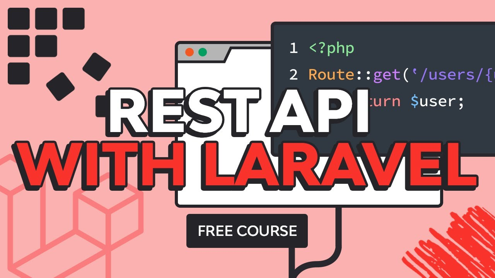

# Laravel API

## Objective

The objective of this project is to study the creation of APIs using the **PHP** language, more specifically with the **Laravel** 9 framework.

## Study Material

For the study of this tool, the video from the **Envato Tuts+** channel was used, which can be found at this YouTube link.

|  |
|-|
| *Available at: https://youtu.be/YGqCZjdgJJk* |

## Step-by-Step

The following step-by-step process was used for creating the API.

### Summary
- [01: Creating the Project](docs/01-creating-the-project.md)
- [02: Designing the Database](docs/02-designing-the-database.md)
- [03: Creating models factories](docs/03-creating-models-factories.md)
- [04: Seeding the Database](docs/04-seeding-the-database.md)
- [05: Versioning and defining routes](docs/05-versioning-and-defining-routes.md)
